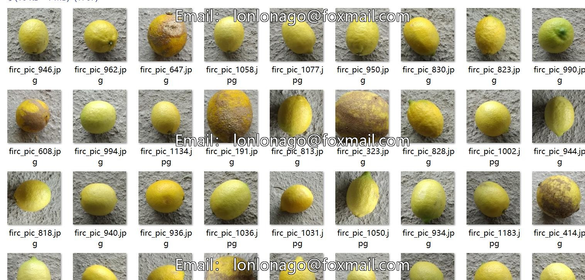
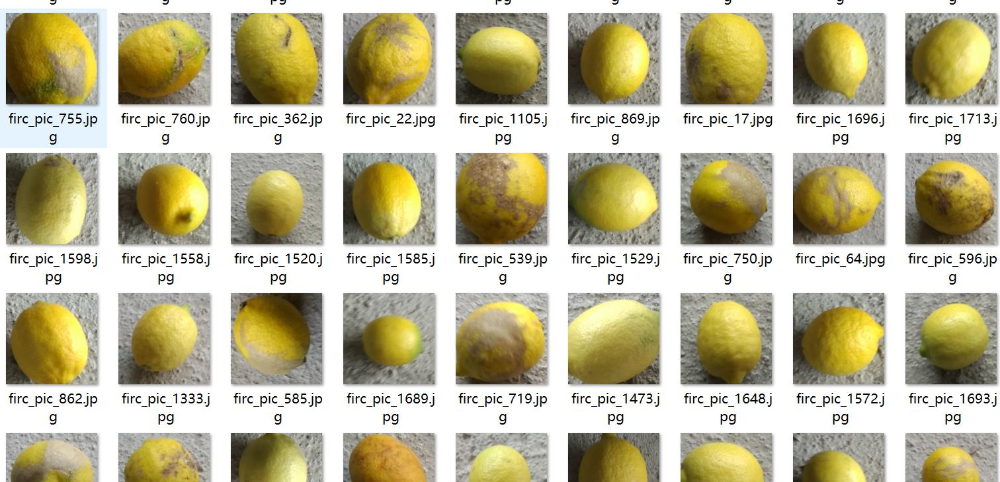
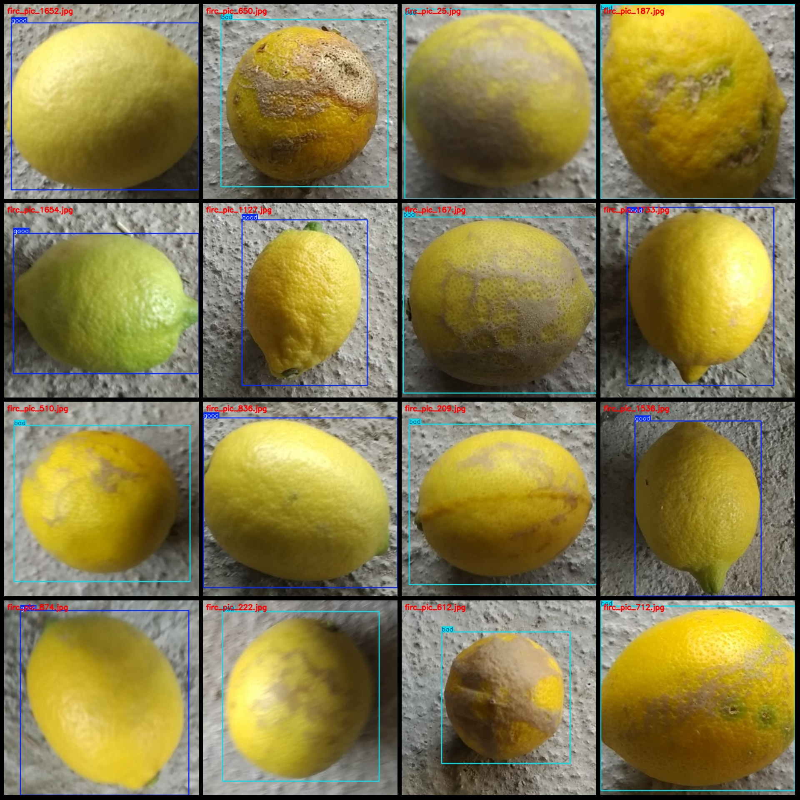
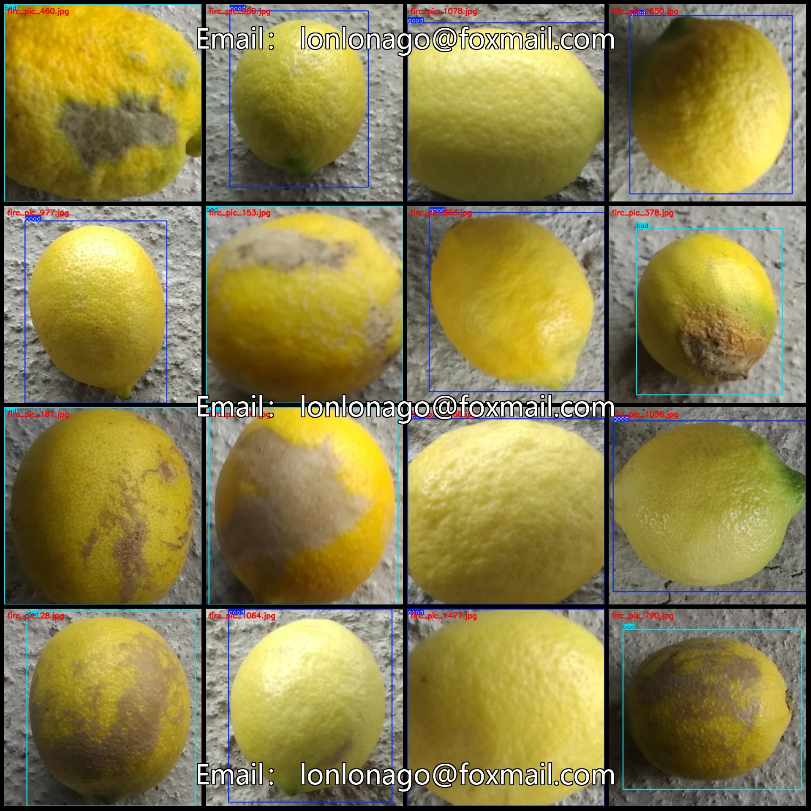

# Lemon Quality Inspection Data Set (VOC+YOLO format, 1767 images in 2 categories)

## Dataset format:
- Pascal VOC format + YOLO format (without split path, only txt files containing jpg images and corresponding VOC format xml file and yolo format txt file)

The number of jpg files is 1767.

## Annotation Number (xml File Count): 1767

## Annotation Number: 1767

## Category Count: 2

The labeled categories are ["bad", "good"].

The number of bounding boxes per category for each class is:
- Bad: 804
- Good: 963

## total boxes:  1767

## Summary:
- Bad pictures account for 804 out of a total of 1,675 pictures.
- Good pictures account for 963 out of a total of 1,675 pictures.

## Images resolution: 640x640

Using Annotation tool: labelImg

The annotation rules are: Draw a box around the category.

## Importance Notice: The dataset does not have a division of training, validation, and testing sets; please allocate them yourself.

## Special Disclaimer: This dataset does not guarantee the accuracy of the trained model or weight files.

Preview of the image:

## Images

Here is a pay link on Stripe ( https://buy.stripe.com/3cs8yP7sY87d0vu9AB ). Please contact me lonlonago@foxmail.com after funding $89, and I will send you a complete data files , thank you!

